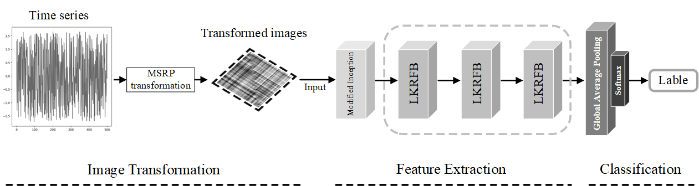

Large Kernel Receptive Fields for Time Series Classification
This is the project of manuscript 'Large Kernel Receptive Fields for Time Series Classification'



## Prerequisite

Tested on Linux, with Python 3.8, PyTorch 1.9.0, CUDA 11.1, and 1x NVIDIA 3090.

##Data Transformation

The dataset in this paper consists of two parts: the original dataset and the transformed MSRP dataset. The original data used in this project comes from the [UCR/UEA archive](http://timeseriesclassification.com/TSC.zip)


**(1) Transform to MSRP images.**

```
Click on MSRP_Transform.py and run it. Or python MSRP_Transform.py
```

**(2) Transform to RP images.**

```
Click on RP_Transform.py and run it. Or python RP_Transform.py
```

**(3) Transform to TRP (Threshhold RP) images.**

```
Click on TRP_Transform.py and run it. Or python TRP_Transform.py
```

## Code 
The code is divided as follows: 
* The main python file contains the necessary code to run all experiements. 
* The utils folder contains the necessary functions to read the datasets and manipulate the data.
* The classifier file contains the classifiers proposed in this paper.
* The constants file contains some parameters that need to be adjusted.

To run a model on all datasets you should issue the following command: 

```
Click on main.py and run it. Adjust the hyperparameters in the constant file.
```

*This code is partly borrowed from [MSRP-IFCN](https://www.sciencedirect.com/science/article/pii/S0031320321005653). Thanks to Ye Zhang.
